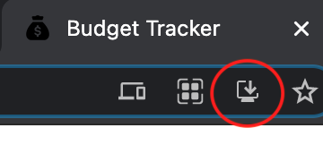
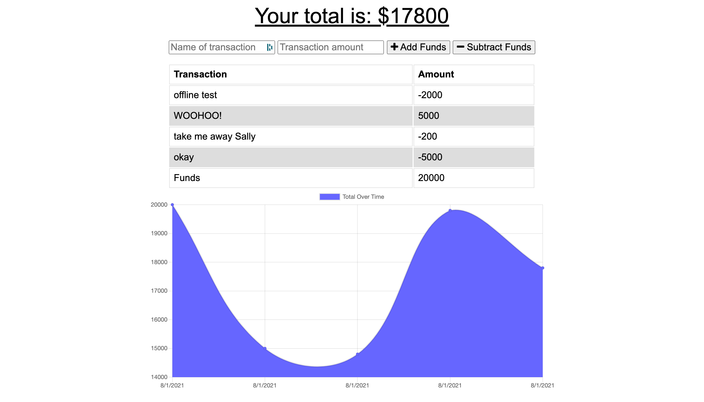

# Budget Tracker 
To add expenses and deposits to their budget with or without an online connection 

## Links

Repo Link: https://github.com/theoneandonlyzako/budget-tracker  
Deployed Link: https://zaks-budget-tracker.herokuapp.com/
  

## License
This project is licensed under the Unlicense license.
  

## Table of Contents 
* [Description](#description)
* [Packages](#packages)
* [Installation](#installation)
* [Usage](#usage)
* [Contributing](#contributing)
* [Contact](#contact)
* [Site Example](#example)
  

## Description
A progrssive web application built to help travelers keep track of their budget while away from home -- and away from a reliable internet connection.. Built with Express, Mongoose, compression, morgan and MongoDB.  

## Packages
- express
- moment
- mongoose
- compression
- morgan
  

## Installation
​1. Make sure you have MongoDB installed on your machine (if you don't, follow the instructions on the [MongoDB Website](https://docs.mongodb.com/manual/installation/)) 
2. Clone the repo 
3. Install dependencies with `npm -i` 
5. Run `npm start` to run the server and make the API live 
  

## Usage
Provides a simple interface for entering expenses and credits, tracks balance changes and displays a chart showing how the balance has changed over time. When used without an internet connection, the app will remember the balance from the last time it was connected to the server, and display changes relative to that balance. Transactions entered while offline are stored in the browser/client's local database (IndexedDB) and sync'ed to the server upon the next successful reconnection. The app can also be installed on a mobile device by using the "Add to Home Screen" option offered by some mobile web browsers.
 

**Install Example**

  

## Contributing
​Contributors: Zak Stamps With Lots of help from our trusty 'ol friend Google.
  

## Contact
If you have any questions about the repo, open an issue or contact me directly at theoneandonlyzako@gmail.com or visit my website at zakstamps.com
  

## Example

  
